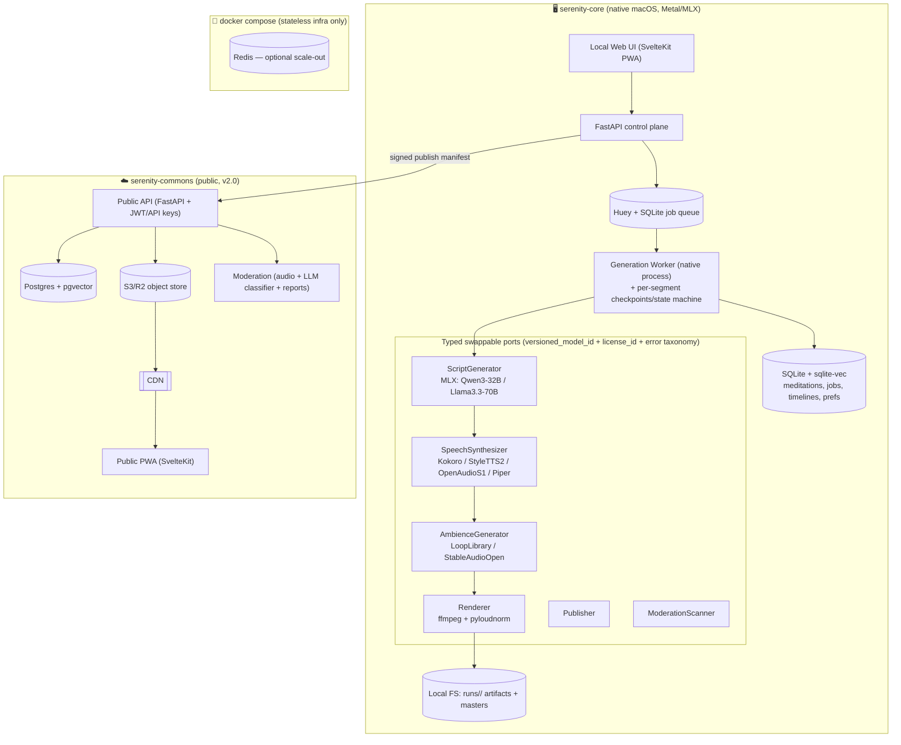

Understood — this is me compiling everything from all the rounds into a single, exhaustive build specification for your coding agent. No partner consultation needed; it's all decided. Here it is.

---

# Serenity — Complete Build Specification
### AI Meditation Generator (self-hosted core) + Community Platform
**Version:** 1.0 (handoff) · **Date:** 2026-07-07 · **Status:** All architecture & model decisions locked
**Audience:** the implementing coding agent. This document is self-contained — build directly from it.

---

## Table of Contents
1. Executive Summary
2. Guiding Principles & Locked Decisions (with rationale)
3. Model Selection
4. System Architecture
5. The Canonical Data Model (timeline)
6. Generation Pipeline (stage-by-stage, with prompts)
7. The Crux: Deterministic Pauses + Continuous Prosody
8. Audio Pipeline (ffmpeg recipes, mixing, mastering)
9. Swappable Backend Interfaces (port signatures)
10. Tech Stack & Reasoning
11. Public Community Platform
12. Reliability, QC, Testing, Observability
13. Roadmap (v0.1 → v1.0 → v2.0)
14. Repository Structure
15. Configuration Approach
16. One-Command Setup (native macOS + Docker)
17. Extension Points
18. Appendix: Risks & Open Questions

---

## 1. Executive Summary

Serenity is two loosely-coupled products sharing one data contract:

1. **`serenity-core`** (open source, self-hosted) — a fully-local pipeline on Apple Silicon (M4 Pro, 48 GB) that turns a prompt ("10-minute sleep meditation for anxiety, soft voice, rain") into a mastered audio file. Flow: **LLM script → compile to timeline → TTS per segment → assemble with exact pauses → ambient bed → mix/master**.
2. **`serenity-commons`** (optional, public) — a web platform where self-hosted instances publish meditations and listeners browse/stream/download on mobile (PWA).

**Non-negotiable design stance:** quality over speed (minutes per generation is fine); everything in the core is open-weights with self-host + redistribution-friendly licenses; the whole system is organized around a **timeline of segments**, generated **piece by piece**, because that is what gives deterministic pause control, bounded failure domains, and swappable models.

**The headline picks:** LLM = **Qwen3-32B @ 6-bit MLX**; TTS = **Kokoro-82M** default (StyleTTS 2 expressive upgrade, OpenAudio S1 local-only, Piper fallback); Music = **CC0 loop library + procedural mixing** (Stable Audio Open swappable); Backbone = **canonical JSON timeline + typed swappable ports**; Local infra = **FastAPI + Huey/SQLite**, Commons infra = **Postgres/pgvector + object store/CDN**; **native ML worker on macOS, Docker for stateless infra only.**

---

## 2. Guiding Principles & Locked Decisions

| # | Decision | Rationale (WHY) |
|---|---|---|
| P1 | **No ML in Docker on macOS.** Native worker process; Docker only for stateless infra (Postgres/Redis/web). | Metal/MLX GPU is inaccessible inside Docker on macOS. This is the single most important operational constraint — document it front-and-center so nobody burns a day on GPU passthrough that doesn't exist. |
| P2 | **The atomic unit is a timeline segment**, not a script or an audio file. Canonical JSON timeline = single source of truth. | A guided meditation *is* an interleaving of speech and deliberate silence. Primitives `{SPEECH, SILENCE, BREATH, MUSIC_CUE}` losslessly encode it. Render, QC, resume, regenerate-one, and the breathing visualizer all read one structure. |
| P3 | **Generate piece by piece at both stages** — LLM writes section-by-section; TTS renders segment-by-segment. | Long single-shot generation loses the thread and repeats ("notice your breath… notice your breath"); long single-shot TTS drifts. Small units → coherence, exact pause control, cheap partial regeneration. |
| P4 | **Pauses are deterministic exact silence segments**, never model-guessed. LLM inline cues are compile-time input only. | Meditation lives or dies on pause precision; TTS timing is unreliable. |
| P5 | **Swappable models via typed ports.** LLM/TTS/music/renderer/publisher/moderation are adapters behind stable interfaces. | The community can add models without touching the core; per-adapter `versioned_model_id` + `license_id` + error taxonomy give reproducibility, license gating, and correct retries. |
| P6 | **LLM = Qwen3-32B @ 6-bit MLX** default; Llama-3.3-70B stage-isolated opt-in HQ; Mistral-24B lean. | Bottleneck is structure/pacing/editing, not parameter count. 32B co-resides with Kokoro; 70B is A/B-it-yourself, not default. |
| P7 | **TTS = Kokoro-82M default** (non-AR consistency wins the 40–80-chunk stitch game + Apache-2.0); StyleTTS 2 expressive upgrade; OpenAudio S1 local-only license-gated; Piper fallback. | Per-segment stitched audio on headphones in silence is maximally unforgiving of AR timbre drift; non-AR determinism gives invisible stitches + reproducible caching. |
| P8 | **Music = CC0 loop library + procedural mixing** for v1; Stable Audio Open swappable. MusicGen out. | Meditation wants continuity, not novelty. Generative audio isn't reliably good/cleanly-licensed yet. MusicGen weights are CC-BY-NC (blocks the Commons). |
| P9 | **Infra by phase.** v0.1–v1.0: Huey + SQLite (+sqlite-vec). v2.0 Commons: Postgres + pgvector, Temporal only if real DAGs emerge. One SQLAlchemy layer, Postgres-shaped from day one. | Keep the self-hosted core featherweight (its promise is "clone & run on one Mac"); requiring a Postgres/Temporal server locally kills self-host adoption. Let heavy infra arrive with the public platform. |
| P10 | **Master to −16 LUFS / −1.5 dBTP; 48 kHz/24-bit FLAC master + AAC/Opus delivery.** | −16 LUFS is intentionally quieter than the −14 streaming norm (comfortable for sleep). FLAC preserves; AAC/Opus deliver efficiently to phones. |

---

## 3. Model Selection

### 3.1 LLM — Script Writer

| Model | License | Runtime / Quant | Footprint (weights+KV) | Quality notes |
|---|---|---|---|---|
| **Qwen3-32B** ⭐ *default* | Apache-2.0 | MLX 6-bit | ~26 GB | Excellent instruction-following & prose steering; co-resides with Kokoro; newest generation. |
| **Llama-3.3-70B** *HQ opt-in* | Llama 3.3 Community (redistributable <700M MAU) | MLX 4-bit, **stage-isolated** | ~40 GB (load→gen→unload→then TTS) | Best raw prose, but diminishing returns once the 3-stage chain is good. A/B it; not default. |
| **Mistral-Small-3.2-24B** *lean* | Apache-2.0 | MLX 4-bit | ~14 GB | Low-footprint / preview mode. |
| **Gemma-3-27B** *alt (multilingual)* | Gemma | MLX 4-bit | ~16 GB | Gentle register; strong multilingual (languages extension). |

**Runtime:** MLX primary (Apple-native, best M-series throughput, cleanest Python API); llama.cpp/GGUF portable fallback for non-Apple hardware.

### 3.2 TTS — Narration (LOCKED four-tier policy)

| Tier | Model | License → Commons? | SR | AR? | Role & WHY |
|---|---|---|---|---|---|
| **Default (public-safe)** | **Kokoro-82M** | Apache-2.0 ✅ | 24 kHz | Non-AR | Identical, invisible stitches across all segments + reproducible caching; the automated narrator for all unattended generation. |
| **Expressive upgrade (public-safe)** | **StyleTTS 2** | MIT-class (verify weights) ✅ | 24 kHz | Non-AR | Reference-audio style → soft/hushed delivery *deterministically*, Commons-legal, no AR drift. Covers most "softer than Kokoro" needs; makes Fish unnecessary for most. |
| **Local-only HQ (license-gated)** | **OpenAudio S1 (Fish)** | CC-BY-NC-SA ❌ | 44.1 kHz | AR | Per-utterance expressive/whisper ceiling **under human curation** only; hard-gated by `license_id`, never reaches Commons. Runs PyTorch-MPS. |
| **Fallback** | **Piper** | MIT ✅ | 22.05 kHz | Non-AR | CPU/ONNX robust degraded mode for non-Apple hardware. |

*Rejected for default:* Chatterbox (MIT but AR-inconsistent), F5-TTS & XTTS-v2 (non-commercial licenses → local-only), OpenVoice V2 (a tone-color converter, use as a cloning *layer* not narrator).
**Fidelity rule:** keep TTS at native SR; do not fake 48 kHz. The genuinely-48 kHz ambient bed sets the master container; upsample voice with `aresample=resampler=soxr`.

### 3.3 Music / Ambience

| Option | Good enough? | License → Commons? | Recommendation |
|---|---|---|---|
| **CC0 loops + procedural mixing** ⭐ | Yes (v1, likely v1.5) | CC0 ✅ | **Default.** 30–50 seamless tagged loops (rain, ocean, drone, singing bowls, forest, brown noise) from Freesound; layer 1–2 beds with randomized gentle gain LFO. |
| **Stable Audio Open 1.0** | Partially (≤47 s textures) | Stability Community (self-host OK) | Experimental swappable `AmbienceGenerator`; generate 30–45 s seed → seamless loop. |
| **Pure-DSP binaural/isochronic** | Yes (for that purpose) | N/A ✅ | First-class bed option (extension). |
| **MusicGen / AudioGen** | Quality yes | CC-BY-NC ❌ | Disqualified. |

---

## 4. System Architecture



**Deployment rule (P1) restated:** the worker + all model backends run as a **native macOS process** (`make worker` or a launchd plist). `docker compose up` starts only optional stateless infra + the web/API containers. Linux/NVIDIA users get an all-Docker path.

---

## 5. The Canonical Data Model

The JSON timeline is authoritative. Prose + inline cues are compile-time input only.

```jsonc
// Meditation timeline (canonical). Stored in DB and as runs/<job_id>/timeline.json
{
  "meditation_id": "uuid",
  "version": 1,
  "meta": {
    "title": "Letting Go of the Day",
    "theme": "sleep",
    "language": "en",
    "target_duration_ms": 600000,
    "voice": "af_heart",            // adapter-specific voice id
    "pacing_profile": "slow_sleep", // maps to speed + silence scaling
    "llm_model_version": "qwen3-32b-mlx-6bit@2026-05",
    "tts_model_version": "kokoro-82b@v1",
    "seed": 12345,
    "license_id": "CC0-1.0"         // computed from all backends; gates publishing
  },
  "segments": [
    { "id": "s0", "type": "MUSIC_CUE", "kind": "fade_in", "at_ms": 0, "len_ms": 4000, "depth_db": 0 },
    { "id": "s1", "type": "SPEECH", "text": "Find a comfortable position, and gently let your eyes close.",
      "voice": "af_heart", "speed": 0.9, "delivery_mode": "hushed",
      "model_version": "kokoro-82b@v1", "cache_key": "sha256:..." },
    { "id": "s2", "type": "SILENCE", "target_ms": 4000, "min_ms": 3000, "max_ms": 8000, "flexible": true },
    { "id": "s3", "type": "BREATH", "in_ms": 4000, "hold_ms": 4000, "out_ms": 6000, "cycles": 3, "guide": "silence" },
    { "id": "s4", "type": "SPEECH", "text": "Notice the weight of your body settling into the surface beneath you.",
      "voice": "af_heart", "speed": 0.9, "delivery_mode": "hushed",
      "model_version": "kokoro-82b@v1", "cache_key": "sha256:..." }
    // ...
  ]
}
```

**Segment field reference:**

| Type | Fields | Notes |
|---|---|---|
| `SPEECH` | `id, text, voice, speed, delivery_mode(warm\|soft\|hushed), model_version, cache_key` | `delivery_mode` is backend-agnostic; each adapter realizes it (Kokoro→voice+DSP; StyleTTS2→reference clip; Fish→inline tags). |
| `SILENCE` | `id, target_ms, min_ms, max_ms, flexible` | Fixed pause ⇒ `min==target==max`; flexible pauses are tuned by the duration-fitting pass. |
| `BREATH` | `in_ms, hold_ms, out_ms, cycles, guide(silence\|chime\|spoken)` | Drives the PWA breathing visualizer; realized as silence, a soft chime, or spoken counts. |
| `MUSIC_CUE` | `kind(fade_in\|fade_out\|duck), at_ms, len_ms, depth_db` | Controls the ambient bed relative to the voice timeline. |

---

## 6. Generation Pipeline (stage-by-stage)

### Stage 1 — PLAN
LLM (Qwen3-32B) → structured outline. **Output = JSON**, not prose.
```jsonc
{ "sections": [
    {"name":"settle","goal":"arrive, release the day","target_ms":90000,"motifs":["weight","breath"]},
    {"name":"body","goal":"progressive relaxation head→feet","target_ms":240000,"motifs":["warmth","heaviness"]},
    {"name":"breath","goal":"guided breathing, 3 cycles","target_ms":120000},
    {"name":"theme","goal":"letting go of the day's worries","target_ms":90000,"motifs":["water","current"]},
    {"name":"return","goal":"drift toward sleep","target_ms":60000}
  ],
  "tone":"warm, unhurried, second-person", "voice":"af_heart", "pacing_profile":"slow_sleep" }
```
**WHY:** the plan owns the arc, keeping a 30-min piece coherent without context bloat.

### Stage 2 — SCRIPT (section by section)
For each section (a 1–4 min sub-arc), the LLM emits prose + lightweight inline cues.
**Context passed to section N:** (a) full compact PLAN, (b) rolling summary + "motifs already used — do not reuse" list, (c) last 1–2 sentences of section N-1 verbatim.
**Inline cue grammar (compile-time only):**
```
[pause 4s]                                  → deliberate SILENCE
[pause 4-8s]                                → flexible SILENCE {min:4000,target:6000,max:8000}
[breath in=4 hold=4 out=6 cycles=3]         → BREATH
[section body]                              → section marker (metadata)
[deliver hushed]                            → sets delivery_mode for following SPEECH
```
**System prompt (embed in repo, `config/prompts/script_system.md`):** encode tone (warm, unhurried, second-person, no "AI slop" like "Let's dive in!"), pacing, and structure; instruct the model to place `[pause]` cues only at *deliberate* pauses (≥1.5 s), letting commas/periods carry micro-pauses.

### Stage 3 — EDITORIAL PASS (whole assembled script)
One LLM pass over the full concatenated script: remove cross-section repetition, smooth tone drift, verify **estimated spoken duration** (word_count ÷ WPM_for_voice_at_speed) ≈ target *before rendering audio*. **WHY:** cheap global coherence + fail-fast on length.

### Stage 4 — COMPILE (deterministic, no model)
Parse prose + cues → canonical timeline. This is where the two-tier pause model (§7) is applied. Compute `cache_key` per SPEECH segment. Validate the timeline against the JSON schema.

### Stage 5 — TTS per segment
Each `SPEECH` → synth at native SR → **edge-silence trim (§7c)** → per-segment loudness normalize (§7e) → cache by `cache_key`.

### Stage 6 — ASSEMBLE
Concatenate speech + exact silence + breath segments with join discipline (§7d). Apply flexible-silence duration fitting (§12).

### Stage 7 — BED + MIX + MASTER
Ambient bed → sidechain-duck → loudness master → encode (§8).

---

## 7. The Crux — Deterministic Pauses + Continuous Prosody

Per-segment TTS risks "list of separate announcements" prosody. The agreed mechanism:

**(a) Segmentation rule = breath group.** A `SPEECH` segment = the largest continuous run of text spoken with *no deliberate pause between* (~20–60 words / one breath-sized thought). Boundaries land at deliberate pauses and nowhere else. **Length is an output of where pauses are, not a fixed sentence count.**

**(b) Two-tier pause model.**
- **Micro-pauses** (comma/period/ellipsis, ~0.2–0.8 s): stay *inside* rendered speech as punctuation → the TTS produces them natively, preserving flow + declination.
- **Deliberate pauses** (≥1.5 s): exact `SILENCE` segments *between* speech segments.
**WHY:** splitting at every comma would over-fragment narration; you only need determinism on the long, meditatively-weighted pauses.

**(c) Edge-silence trim (mandatory for correctness).** After each render, detect + trim leading/trailing baked silence to a fixed ~20–30 ms residual, so the `SILENCE` segment is the *sole* source of pause duration. Without this, "exact pauses" are silently wrong. (Detect via a −40 dBFS threshold scan from each edge, or `ffmpeg silenceremove`.)

**(d) Join discipline.** **Never crossfade speech into a deliberate silence.** SPEECH→SILENCE→SPEECH (normal): declick fade-out (~15–30 ms) into silence, fade-in on next segment, zero-crossing trims on voice edges. Only when one breath group was split mid-thought for length: a 10–20 ms equal-power crossfade. Real fades + ducking belong to the **music bed**, never the voice.

**(e) Per-segment loudness normalization** to a shared internal LU target *before* mixing; then the whole-mix −16 LUFS master at the end. **WHY:** matching segment loudness makes stitches inaudible; normalizing only the final master is too late.

**(f) Slow-calm via native speed (~0.9×)** on the TTS, preferred over post-hoc time-stretch. Keep rubberband/soxr stretch only as a fallback for backends without a speed knob, applied per speech segment (uniform factor) so exact silences are untouched.

**(g) Why cold-start is a non-issue here:** the reset lands exactly at a deliberate pause — precisely where a human guide resets to calm baseline. A reset masked by a 4-second silence *is* the target cadence, not a defect. And Kokoro (non-AR) makes every cold-start *identical*, so there is no cross-segment wobble.

---

## 8. Audio Pipeline (concrete recipes)

**Tools:** `ffmpeg`/`ffprobe` (authoritative for all critical audio), `pyloudnorm` (ITU-R BS.1770 measurement in Python), `soxr` resampler, `rubberband` (fallback stretch only). `pydub` allowed only for non-critical convenience — never the main renderer.

**Silence block (exact):**
```bash
ffmpeg -f lavfi -i anullsrc=r=24000:cl=mono -t 4.0 -c:a pcm_s16le silence_4000ms.wav
```

**Edge-silence trim on a rendered speech segment:**
```bash
ffmpeg -i seg.wav -af "silenceremove=start_periods=1:start_threshold=-40dB:start_silence=0.02,\
areverse,silenceremove=start_periods=1:start_threshold=-40dB:start_silence=0.02,areverse" seg_trim.wav
```

**Per-segment loudness normalize (to shared internal target, e.g. −20 LUFS pre-mix):**
```bash
ffmpeg -i seg_trim.wav -af "loudnorm=I=-20:TP=-2:LRA=7" seg_norm.wav
```

**Concatenate assembled narration (concat demuxer with declick fades applied per segment).** Build a `concat.txt` listing speech/silence wavs in order; apply short `afade` at speech edges beforehand.

**Ambient bed — length-match a CC0 loop:**
```bash
# seamless loop to >= target, then trim + fade
ffmpeg -stream_loop -1 -i rain_loop.flac -t 610 -af "afade=t=in:st=0:d=3,afade=t=out:st=607:d=5" bed.wav
```

**Mix voice + bed with sidechain ducking (music dips under voice):**
```bash
ffmpeg -i narration.wav -i bed.wav -filter_complex \
"[1:a]aresample=48000[bed]; \
 [0:a]aresample=48000,asplit=2[voice][vkey]; \
 [bed][vkey]sidechaincompress=threshold=0.03:ratio=6:attack=20:release=400:makeup=1[ducked]; \
 [voice][ducked]amix=inputs=2:normalize=0[mix]" -map "[mix]" mixed_48k.wav
```

**Master to −16 LUFS / −1.5 dBTP (two-pass loudnorm) and encode:**
```bash
# pass 1 measures; pass 2 applies measured values (I=-16, TP=-1.5, LRA target ~9)
ffmpeg -i mixed_48k.wav -af "loudnorm=I=-16:TP=-1.5:LRA=9:measured_I=..:measured_TP=..:measured_LRA=..:measured_thresh=..:linear=true" \
  -ar 48000 -sample_fmt s32 master.flac              # 48kHz/24-bit FLAC master
ffmpeg -i master.flac -c:a aac -b:a 160k delivery.m4a  # AAC-LC delivery
ffmpeg -i master.flac -c:a libopus -b:a 96k delivery.opus  # Opus delivery
```

**Delivery encodes:** FLAC 48 kHz/24-bit (archive/master) · AAC-LC ~128–160 kbps (M4A, broad phone compat) · Opus ~96 kbps (efficient web streaming).

---

## 9. Swappable Backend Interfaces (Python port signatures)

All ports live in `src/serenity/ports/`. Every adapter carries `versioned_model_id`, `license_id`, deterministic `seed`, and classifies errors as `TransientError` (retryable) vs `FatalError`.

```python
# src/serenity/ports/base.py
from dataclasses import dataclass
from enum import Enum

class ErrorClass(Enum):
    TRANSIENT = "transient"   # retry with backoff
    FATAL = "fatal"           # do not retry; surface

class TransientError(Exception): ...
class FatalError(Exception): ...

@dataclass(frozen=True)
class BackendInfo:
    name: str
    versioned_model_id: str      # e.g. "kokoro-82b@v1"
    license_id: str              # SPDX; used for publish gating, e.g. "Apache-2.0", "CC-BY-NC-SA-4.0"
    redistributable: bool        # False => output cannot reach the Commons
```

```python
# src/serenity/ports/script_generator.py
from typing import Protocol

class ScriptGenerator(Protocol):
    info: "BackendInfo"
    def plan(self, prompt: "MeditationRequest") -> "Plan": ...
    def write_section(self, plan: "Plan", section_idx: int,
                      rolling_summary: str, prev_tail: str) -> "SectionDraft": ...
    def editorial_pass(self, full_script: str, target_ms: int) -> "EditedScript": ...
```

```python
# src/serenity/ports/speech_synthesizer.py
from typing import Protocol

class SpeechSynthesizer(Protocol):
    info: "BackendInfo"
    def voices(self) -> list["VoiceSpec"]: ...
    def synthesize(self, text: str, voice: str, speed: float,
                   delivery_mode: str, seed: int) -> "AudioBuffer":  # native SR, mono
        """Adapter realizes delivery_mode: Kokoro->voice+DSP; StyleTTS2->ref clip; Fish->inline tags."""
```

```python
# src/serenity/ports/ambience_generator.py
class AmbienceGenerator(Protocol):
    info: "BackendInfo"
    def tags(self) -> list[str]: ...                 # rain, ocean, drone, forest, brown_noise, ...
    def render_bed(self, theme_tags: list[str], duration_ms: int, seed: int) -> "AudioBuffer":  # 48kHz stereo
```

```python
# src/serenity/ports/renderer.py
class Renderer(Protocol):
    def assemble_narration(self, segments: list["RenderedSegment"]) -> "AudioBuffer": ...
    def mix(self, narration: "AudioBuffer", bed: "AudioBuffer", cues: list["MusicCue"]) -> "AudioBuffer": ...
    def master(self, mixed: "AudioBuffer", target_lufs: float = -16.0, tp_db: float = -1.5) -> "MasterResult": ...
    def encode(self, master_flac: "Path") -> "DeliveryFiles": ...   # m4a + opus
```

```python
# src/serenity/ports/publisher.py
class Publisher(Protocol):
    def publish(self, manifest: "PublishManifest", files: "DeliveryFiles") -> "PublishResult":
        """MUST reject if manifest.license_id is non-redistributable (license gate)."""

# src/serenity/ports/moderation_scanner.py
class ModerationScanner(Protocol):
    def scan_text(self, script: str) -> "ModerationResult": ...
    def scan_audio(self, master_flac: "Path") -> "ModerationResult": ...
```

**Adapter registry** (`config/models.yaml`) maps names → adapter class + `versioned_model_id` + `license_id` + runtime, so swapping a backend is a config edit.

---

## 10. Tech Stack & Reasoning

| Concern | Choice | Reasoning |
|---|---|---|
| Backend | **FastAPI** (Python) | Pipeline is Python-heavy; easiest model integration; async control plane. |
| Job queue (local) | **Huey + SQLite** + explicit per-segment checkpointed state machine | ~90% of Temporal's resume value at ~5% of setup cost; a self-hoster never runs a Temporal server. Job contracts designed so a Huey→Temporal swap doesn't touch domain logic. |
| Job queue (Commons, later) | **Temporal** *only if* real DAGs emerge (moderation with human review, batch re-encode, worker fan-out) | Earns its complexity only for branching/human-wait/fan-out — none of which the linear local pipeline has. |
| DB (local) | **SQLite + sqlite-vec** | A single user's few hundred meditations don't need Postgres; brute-force/indexed cosine is sub-ms. Requiring a Postgres server locally kills self-host adoption. |
| DB (Commons) | **Postgres + pgvector** | Multi-user metadata + semantic search + personalization. |
| ORM | **One SQLAlchemy layer, Postgres-shaped from day one** | Same code path local↔Commons; SQLite by default, Postgres via config. |
| Storage (local) | **Local FS** `runs/<job_id>/` + a `library/` for finished masters | Simple, inspectable, checkpointable. |
| Storage (Commons) | **S3/R2 object store + CDN** | Audio is bandwidth-heavy and cacheable. |
| Frontend | **SvelteKit PWA** (both local UI and Commons) | Lean bundles matter for a mobile-first, offline-caching PWA; SSR/SEO is fine for shareable pages. (Next.js is a defensible alternative for the Commons only.) |
| ML runtime | **MLX** (LLM + Kokoro/StyleTTS2), **PyTorch-MPS** (Fish), **ONNX** (Piper) | Native Metal; MLX is Apple-first-party and fastest on M-series. |

---

## 11. Public Community Platform (`serenity-commons`, v2.0)

**Publishing flow (self-hosted → Commons):**
1. User authenticates their instance to the Commons (API key or instance token; OAuth device flow for first pairing).
2. Instance POSTs a **signed publish manifest** + delivery encodes (m4a + opus; FLAC optional).
3. Commons verifies signature, runs moderation, and **hard-gates on `license_id`** — any artifact whose backend chain is non-redistributable (Fish/XTTS/restrictive beds) is rejected at upload.

**Publish manifest schema:**
```jsonc
{ "meditation_id":"uuid", "title":"...", "theme":"sleep", "language":"en",
  "duration_ms":600000, "voice":"af_heart",
  "llm_model_version":"qwen3-32b-mlx-6bit@2026-05", "tts_model_version":"kokoro-82b@v1",
  "seed":12345, "license_id":"CC0-1.0", "instance_id":"uuid",
  "content_license":"CC-BY-4.0",          // license the uploader grants to listeners
  "audio":{"m4a":{"bytes":..,"sha256":..},"opus":{"bytes":..,"sha256":..}},
  "signature":"ed25519:..." }
```

**API (REST, versioned `/v1`):** `POST /v1/meditations` (publish), `GET /v1/meditations?theme=&lang=&duration=&sort=` (browse/search), `GET /v1/meditations/{id}` (detail + stream URLs), `POST /v1/meditations/{id}/report` (moderation), `POST /v1/auth/instances` (pair instance). Auth: JWT for user sessions, per-instance API keys (Ed25519-signed manifests) for publishing.

**Mobile:** **PWA, not native, for v1.** Installable, service-worker offline caching of downloaded meditations, media-session API for lock-screen controls, one codebase, no app-store friction. Native only later if deep background-audio integration is needed.

**Moderation:** automated audio checks + an LLM text classifier on the (optionally uploaded) script + user-report queue. Human review at scale is where Temporal on the *server* would be justified.

**Licensing & privacy:** every upload carries an explicit `content_license` (default CC-BY-4.0 or CC0). Generation is fully local — no script/voice/prompt data leaves the user's machine unless they choose to publish. Accounts exist only on the Commons; the self-hosted core needs no account.

---

## 12. Reliability, QC, Testing, Observability

**Resumability & retries:**
- Per-segment checkpoints in `runs/<job_id>/segments/<id>/`. A crash resumes from the last completed segment.
- **Content-addressed cache key** per SPEECH segment = `sha256(normalized_text + voice + model_version + speed + delivery_mode + seed)`. Regenerating a section re-renders only changed segments; unchanged ones are cache hits. *This is what makes "regenerate one piece" cheap.*
- Retry policy driven by the per-port error taxonomy: `TransientError` → exponential backoff (e.g. 3 tries); `FatalError` → surface immediately.

**Automated QC gate (per segment + whole file):**
| Check | Method | Threshold / action |
|---|---|---|
| TTS garble / dropout / truncation | Round-trip ASR (whisper.cpp) → normalized-text CER | **Lenient smoke test.** Gross mismatch → fail+regenerate (new seed/re-prompt section). Borderline (homophones, short soft segments) → pass. |
| Dead-air inside speech | Silence-scan within a SPEECH segment | Any long internal gap = dropout defect (long gaps are their own SILENCE segments) → regenerate. |
| Clipping / true-peak | `ffprobe` / astats | > −1.0 dBTP pre-master → fail. |
| Wrong duration | Compare rendered total vs target | Out of tolerance → duration-fitting pass. |
| Boundary artifacts | Detect discontinuity at joins | Regenerate the offending segment **plus immediate neighbors**. |

**Duration fitting:** flexible `SILENCE` segments carry `{min,target,max}`. After render, measure total; a fitting pass tunes only flexible silences (never speech, never fixed pauses) to hit the global target within tolerance.

**Testing strategy:**
- **Unit/contract tests per adapter** — each backend tested against its port contract (deterministic seed → stable output shape).
- **Golden-file audio tests** — a fixed short prompt/timeline renders to a byte/loudness-stable master (tolerance on loudness, exact on structure).
- **Integration test** — full pipeline on a fixed 2-minute prompt, asserting QC gate passes and duration ≈ target.
- **Compiler tests** — inline-cue grammar → timeline correctness (two-tier pauses, flexible silences).

**Observability:** structured JSON logging per job/stage/segment; metrics (per-stage latency, retry counts, QC pass/fail rates, cache hit rate); the artifact manifest per job is the audit record.

---

## 13. Roadmap

| Phase | Scope & Milestones | Rough effort |
|---|---|---|
| **v0.1 — personal local pipeline** | CLI only. Qwen3-32B (MLX) 3-stage script → compiler → canonical timeline → Kokoro per-segment (edge-trim + per-seg loudness) → exact silences + join discipline → CC0 loop bed → ffmpeg duck/master → FLAC+AAC. Hard-coded config. **Goal: a good meditation from one command.** | ~2–4 weeks |
| **v1.0 — polished self-hosted app** | FastAPI + Huey/SQLite + SvelteKit PWA; job progress UI; parameter presets; full QC gate; per-segment checkpoint/resume + content-addressed cache; StyleTTS 2, OpenAudio S1 (license-gated), Piper adapters; blind A/B/C TTS harness; one-command setup (native + Docker infra). | ~6–10 weeks |
| **v2.0 — public Commons** | Postgres+pgvector, S3/R2+CDN, signed-manifest publishing + license gate, accounts/auth, browse/search/stream, moderation queue, PWA offline caching + media-session controls. | ~8–12 weeks |

---

## 14. Repository Structure

```
serenity/
├── README.md                      # includes the macOS-Docker-GPU warning up front
├── docker-compose.yml             # STATELESS INFRA + web/api ONLY (no ML)
├── Makefile                       # `make setup`, `make worker` (native), `make dev`
├── pyproject.toml
├── config/
│   ├── default.yaml               # layered config (see §15)
│   ├── models.yaml                # adapter registry: name → class + versioned_model_id + license_id + runtime
│   ├── pacing_profiles.yaml       # slow_sleep, focus, daytime → speed + silence scaling
│   └── prompts/
│       ├── plan_system.md
│       ├── script_system.md
│       └── editorial_system.md
├── src/
│   └── serenity/                  # installable local-core Python package
│       ├── ports/                 # base, script_generator, speech_synthesizer, ambience_generator, renderer, publisher, moderation_scanner
│       ├── adapters/
│       │   ├── llm/               # mlx_qwen3.py, mlx_llama3_hq.py, mlx_mistral.py, llamacpp.py
│       │   ├── tts/               # kokoro.py, styletts2.py, openaudio_s1.py, piper.py
│       │   ├── ambience/          # loop_library.py, stable_audio_open.py, binaural_dsp.py
│       │   └── renderer/          # ffmpeg_renderer.py
│       ├── timeline/              # schema.py (JSON Schema + dataclasses), compiler.py (prose+cues → timeline)
│       ├── pipeline/              # orchestrator.py, state_machine.py, checkpoint.py, cache.py, duration_fit.py
│       ├── qc/                    # asr_roundtrip.py, audio_checks.py, gate.py
│       └── api/                   # fastapi app, huey_tasks.py, progress.py
├── db/                            # sqlalchemy models (Postgres-shaped), migrations (alembic)
├── assets/
│   └── ambience/                  # CC0 loop library (tagged) + LICENSES.md
├── web/                           # SvelteKit PWA (local UI)
├── commons/                       # v2.0: api/, web/, moderation/
├── tests/                         # unit, contract, golden-file, integration
└── docs/                          # this spec + generated "why we do what" docs
```

---

## 15. Configuration Approach

Layered YAML + environment overrides (`SERENITY_*`). Precedence: `config/default.yaml` < `config/local.yaml` (gitignored) < env vars < CLI flags.

```yaml
# config/default.yaml
llm:
  backend: mlx_qwen3            # from models.yaml
  hq_backend: mlx_llama3_hq     # opt-in via --hq
  max_context_tokens: 8192
tts:
  backend: kokoro               # default; expressive: styletts2; local_only: openaudio_s1; fallback: piper
  voice: af_heart
  speed: 0.9
ambience:
  backend: loop_library
  default_tags: [rain, drone]
render:
  target_lufs: -16.0
  true_peak_db: -1.5
  master_format: flac_48k_24bit
  delivery: [aac_160k, opus_96k]
pauses:
  micro_max_ms: 800             # <= stays inside speech as punctuation
  deliberate_min_ms: 1500       # >= becomes an exact SILENCE segment
pipeline:
  checkpoint_dir: ./runs
  cache: content_addressed
storage:
  db_url: sqlite:///./serenity.db   # Commons: postgresql+psycopg://...
```

---

## 16. One-Command Setup

**The macOS reality (state this at the top of the README):** GPU/Metal is **not** accessible inside Docker on macOS, so the ML worker runs **natively**. Docker is used only for stateless infra + the web/API containers.

**Apple Silicon (recommended):**
```bash
git clone https://github.com/you/serenity && cd serenity
make setup          # creates a native venv, installs MLX + PyTorch(MPS) + ffmpeg (brew), downloads model weights
make infra          # docker compose up -d  (optional: Redis; nothing ML)
make worker         # starts the NATIVE ML worker (or install the launchd plist)
make dev            # FastAPI + SvelteKit dev servers
# CLI (v0.1):
serenity generate --theme sleep --minutes 10 --voice af_heart --bed rain
```

**Linux + NVIDIA (community):** an all-Docker path is provided (`docker-compose.gpu.yml`) since GPU passthrough works there; the worker runs in-container with CUDA.

`make worker` optionally installs a **launchd plist** so the native worker restarts on boot/crash.

---

## 17. Extension Points

| Enhancement | How it plugs in |
|---|---|
| **New languages** | Swap a multilingual LLM (Gemma-3) + a multilingual TTS voice/adapter; `language` is already a timeline/manifest field. |
| **Guided breathing timing** | `BREATH` is a first-class timeline event; the PWA reads it for an animated visualizer synced to audio. Change patterns via `pacing_profiles.yaml`. |
| **Binaural beats / isochronic** | Pure-DSP `AmbienceGenerator` backend (`binaural_dsp.py`), layered as an additional bed. No model needed. |
| **User preference memory / personalization** | Embed a user's history in sqlite-vec (local) / pgvector (Commons); feed retrieved preferences into the Stage-1 PLAN prompt. |
| **Generative music** | Drop in when open models mature — it's "just another `AmbienceGenerator` adapter" (Stable Audio Open already scaffolded). |
| **New TTS/LLM** | Implement the port; `delivery_mode` abstraction means no pipeline rewrite. Register in `models.yaml` with `license_id`. |
| **Multi-voice meditations** | `voice` is per-SPEECH-segment; assign different voices to different sections. |

---

## 18. Appendix — Risks & Open Questions

1. **TTS is the one subjective, empirical call.** Render the same 10-min meditation through Kokoro (soft voice + DSP), StyleTTS 2 (hushed reference clip), and OpenAudio S1 (soft tags); blind headphone A/B/C for artifacts, timbre drift at stitch points, low-energy stability. The code supports all three regardless of outcome. Expected: Kokoro or StyleTTS 2 wins for unattended; Fish only under human curation.
2. **License verification before anything reaches the Commons.** Confirm current SPDX for: OpenAudio S1 (CC-BY-NC-SA; flagship API-only, only S1-mini open) → local-only; StyleTTS 2 weights (MIT? verify); F5-TTS / XTTS-v2 (non-commercial) → local-only; every CC0 loop in `assets/ambience/`. License terms move — the `license_id` gate is the safety net.
3. **HQ 70B mode viability.** Confirm load→unload→TTS stage isolation is fast enough to be usable, and A/B whether the quality gain over Qwen3-32B justifies keeping it. Honestly documented as "probably not worth it for most."
4. **Cross-segment consistency in practice.** Even with non-AR Kokoro, validate that 40–80-segment stitching is seamless; the boundary-artifact QC check + per-segment loudness norm are the safeguards.
5. **Edge-silence trim correctness.** This is the linchpin of the "exact pauses" guarantee — write a golden-file test asserting trimmed segments end within the ±5 ms residual window before shipping.
6. **ASR QC false-positives on soft/short segments.** Keep the CER threshold lenient; whisper.cpp is unreliable on 2-second hushed utterances — treat borderline as pass to avoid needless re-rolls.
7. **The one deferred infra choice:** whether v1 ships the Postgres-shaped SQLAlchemy layer immediately (recommended) while running SQLite by default — verify the abstraction holds as the Commons schema firms up.

---

That's the complete specification — data model, pipeline, audio recipes, port interfaces, tech stack, public platform, reliability, roadmap, repo layout, config, setup, and open questions, with the *why* attached throughout. Your coding agent can start at v0.1 (§13) building the timeline schema + compiler first (§5, §7), then the Kokoro `SpeechSynthesizer` adapter, then the assembler and QC gate.

Want me to also generate the **literal starter files** — the JSON Schema for the timeline, the Python port stubs from §9, and the `models.yaml` / `default.yaml` configs — so the agent has real files to fill in rather than transcribe from this doc?
